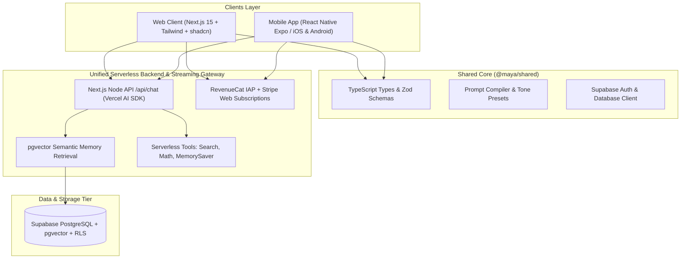

# TECHNICAL ARCHITECTURE & IMPLEMENTATION PLAN: Maya Chat

```yaml
---
document_id: "ARCH-MAYA-001"
title: "Maya Chat: System Architecture & Dual-Platform Monorepo Blueprint"
version: "1.0.0"
status: "APPROVED"
stage: "BUILD_MVP"
last_updated: "2026-09-10"
lead_engineer: "team-mates/cto"
assigned_squad:
  - "team-mates/vp-webapps"
  - "team-mates/vp-mobile-apps"
  - "team-mates/vp-backend"
  - "team-mates/vp-databases"
  - "team-mates/head-of-design"
tech_stack: "Next.js 15, React Native Expo SDK (iOS/Android), TypeScript, Tailwind CSS / NativeWind, Supabase (PostgreSQL + pgvector + RLS), Vercel AI SDK, Stripe, RevenueCat"
target_timeline: "14-Day Sprint (dual-track checklist in §4 superseded)"
---
```

> **Engineering execution (2026-09-10):** This file remains the **schema + monorepo blueprint**. Handover, stack, system design, and roadmap: [`PROJECT_DESCRIPTION.md`](PROJECT_DESCRIPTION.md), [`tech-stack.md`](tech-stack.md), [`technical-plan.md`](technical-plan.md), [`roadmap.md`](roadmap.md). Those docs supersede the Edge chat assumption, OpenAI `vector(1536)` embedding default, the §4 dual-platform 14-day checklist, and **single-model / Free+Pro-only billing**. `profiles.is_pro` below is legacy — authorize on `entitlements.plan` + `plans` / `plan_models`. Canonical roster is **8 curated agents**, two of them `free_tier` (Marcus, Dr. Priya). Catalog tables (`models`, `plans`, `plan_models`, `entitlements`, `usage_events`) live in [`technical-plan.md`](technical-plan.md) §6. Chat runtime is **Node**, not Edge.

## 1. Universal Cross-Platform Architecture Overview



---

## 2. Turborepo Monorepo Structure

```
maya-chat/
├── apps/
│   ├── web/                    # Next.js 15 App Router (Gallery, Studio, Chat)
│   │   ├── app/
│   │   │   ├── (auth)/         # Supabase Auth SSR (Google, Apple)
│   │   │   ├── (chat)/         # Streaming conversation interface
│   │   │   ├── studio/         # Agent Builder with split-screen preview
│   │   │   └── api/chat/       # Vercel AI SDK Node runtime route
│   │   └── components/         # shadcn/ui components & markdown renderer
│   │
│   └── mobile/                 # React Native Expo SDK (iOS & Android)
│       ├── app/                # Expo Router (Tabs, Chat Screen, Voice Drawer)
│       └── components/         # NativeWind UI components
│
├── packages/
│   ├── shared/                 # Core types, prompt compiler, tone modifiers
│   │   ├── src/types.ts
│   │   ├── src/prompt-compiler.ts
│   │   └── src/tones.ts
│   └── database/               # Supabase client, migrations & RLS policies
│       ├── src/client.ts
│       └── supabase/migrations/
│
└── supabase/                   # Local Supabase config, migrations & pgvector setup
```

---

## 3. Database Schema Blueprint (Supabase PostgreSQL + pgvector)

```sql
-- 1. Enable Vector Extension
create extension if not exists vector;

-- 2. Global User Profile Table
create table public.profiles (
  id uuid primary key references auth.users(id) on delete cascade,
  display_name text,
  preferred_language text default 'en',
  global_bio text,
  plan text, -- optional cache of entitlements.plan; never authorize on this
  created_at timestamptz default now() not null,
  updated_at timestamptz default now() not null
);

-- 3. Agents Table
create table public.agents (
  id uuid primary key default gen_random_uuid(),
  user_id uuid references auth.users(id) on delete cascade, -- null for system curated
  name text not null,
  tagline text not null,
  avatar_url text,
  category text check (category in ('learning', 'philosophy', 'productivity', 'wellbeing', 'lifestyle', 'custom')) not null,
  system_prompt text not null,
  language_preset text default 'en',
  tone_settings jsonb default '{"warmth": 0.8, "directness": 0.5, "humor": 0.5}'::jsonb,
  tools_enabled text[] default '{}',
  is_curated boolean default false,
  is_public boolean default false,
  free_tier boolean not null default false, -- Marcus + Dr. Priya only; Plus/Pro see all curated
  created_at timestamptz default now() not null
);

-- 4. Agent Episodic Memory Table
create table public.agent_memories (
  id uuid primary key default gen_random_uuid(),
  user_id uuid references auth.users(id) on delete cascade not null,
  agent_id uuid references public.agents(id) on delete cascade not null,
  content text not null,
  embedding vector(1024), -- dim pinned at scaffold; do not copy 1536 from older drafts
  metadata jsonb default '{}'::jsonb,
  created_at timestamptz default now() not null
);

-- 5. Conversations Table
create table public.conversations (
  id uuid primary key default gen_random_uuid(),
  user_id uuid references auth.users(id) on delete cascade not null,
  agent_id uuid references public.agents(id) on delete cascade not null,
  title text not null default 'New Chat',
  created_at timestamptz default now() not null,
  updated_at timestamptz default now() not null
);

-- 6. Messages Table
create table public.messages (
  id uuid primary key default gen_random_uuid(),
  conversation_id uuid references public.conversations(id) on delete cascade not null,
  role text check (role in ('user', 'assistant', 'system', 'tool')) not null,
  content text not null,
  tool_calls jsonb,
  tokens_used integer default 0,
  created_at timestamptz default now() not null
);

-- 7. Row Level Security Policies
alter table public.profiles enable row level security;
alter table public.agents enable row level security;
alter table public.agent_memories enable row level security;
alter table public.conversations enable row level security;
alter table public.messages enable row level security;

create policy "Users manage own profile" on public.profiles for all using (auth.uid() = id);

create policy "Users view curated agents and own agents" on public.agents
  for select using (is_curated = true or auth.uid() = user_id or is_public = true);

create policy "Users manage their own custom agents" on public.agents
  for all using (auth.uid() = user_id);

create policy "Users access their own agent memories" on public.agent_memories
  for all using (auth.uid() = user_id);

create policy "Users access their own conversations" on public.conversations
  for all using (auth.uid() = user_id);

create policy "Users access messages in their conversations" on public.messages
  for all using (
    conversation_id in (select id from public.conversations where user_id = auth.uid())
  );
```

---

## 4. 14-Day Sprint Delivery Roadmap

**Superseded.** Do not execute this dual-track list. Use [`roadmap.md`](roadmap.md) (Web MVP days 1–14, Mobile v1 days 15–21, voice / RevenueCat / real sandbox → v1.1).

Historical checklist (kept for traceability):

- [ ] **Days 1–3**: Supabase DB setup (pgvector, tables, RLS policies), Auth (Apple + Google OAuth), Monorepo scaffolding (`apps/web`, `apps/mobile`, `packages/shared`).
- [ ] **Days 4–7**: Streaming chat engine with Vercel AI SDK (`streamText`) on Web & Mobile SSE client + Agent Selector UI.
- [ ] **Days 8–10**: Visual Agent Builder (Tone sliders, language presets) & Essential Tools (`webSearch`, `mathSolver`, `saveMemory`) on Web and Mobile.
- [ ] **Days 11–12**: `pgvector` memory retrieval pipeline + Stripe (Web) & RevenueCat (iOS/Android IAP) subscription sync.
- [ ] **Days 13–14**: Mobile native voice testing, push notifications, end-to-end smoke testing, and Vercel & Expo EAS builds.
