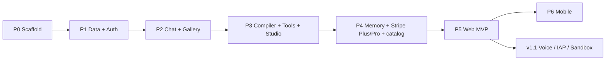

# ROADMAP: Maya Chat

```yaml
---
document_id: "ROAD-MAYA-001"
title: "Maya Chat: Phased Engineering Roadmap"
version: "1.0.0"
status: "APPROVED-FOR-BUILD"
stage: "BUILD_MVP"
last_updated: "2026-09-10"
lead_engineer: "team-mates/cto"
horizon: "21 days (Web MVP D1–14, Mobile v1 D15–21)"
related:
  - "tech-stack.md"
  - "technical-plan.md"
  - "architecture.md"
  - "prd.md"
---
```

Build sequence for Maya Chat. Stack: [`tech-stack.md`](tech-stack.md). Design: [`technical-plan.md`](technical-plan.md).

This **supersedes** the dual-track 14-day checklist in [`architecture.md`](architecture.md) §4. That checklist packed web + iOS + Android + voice + Stripe + RevenueCat into two weeks. It is not a solo-ops plan.

**North star:** a stranger can sign in on the web, talk to Marcus on a Free model, hit a Plus/Pro paywall (agent, quota, or model), and pay Stripe — by the end of Day 14. You can add a model to Plus with SQL, no deploy.

---

## 0. Principles

1. **Vertical slices.** Each phase leaves something runnable, not a pile of unwired modules.
2. **Web first.** Mobile is a client of the same API. If mobile slips, the company still has a product.
3. **Persona quality before chrome.** Prompt compiler + streaming persistence beat polish.
4. **Cut the tail.** Voice, push, RevenueCat, real code sandbox are v1.1. They are listed so they are not “forgotten”; they are not in the 14-day DoD.
5. **Company gates on every phase exit:** RLS (if new tables), Zod, no secrets on the client, `tsc --noEmit` clean.

Roles below are Team Freedom pod labels. One founder + agents may wear all of them.

---

## Phase 0 — Scaffold (Day 0–1)

**Owner:** CTO  
**Depends on:** none

- [x] pnpm + Turborepo: `apps/web`, `packages/shared`, `packages/database`
- [x] `apps/web` via Next.js 15 (App Router, Tailwind 4, Maya Street Cast tokens; shadcn components in a later PR)
- [x] `.env.example` from [`tech-stack.md`](tech-stack.md) §8
- [ ] Supabase project + `supabase/config.toml` + local `supabase start`
- [x] Confirm live **OpenRouter** model ids for the seed catalog (`apps/web/lib/openrouter/catalog.ts`)
- [ ] Pin embedding **model id** (dim is `vector(1024)` in the first migration)
- [x] CI: `lint`, `typecheck`, empty `test` pipeline
- [ ] Vercel project wired to the web app (preview deploys)

**Exit:** `apps/web` hello-world on Vercel preview; env documented; embedding dim known.

**Not in this phase:** Expo app (stub folder optional, no time spent).

---

## Phase 1 — Data + Auth (Day 1–3)

**Owner:** VP Databases + VP Backend  
**Depends on:** Phase 0

- [ ] Migrations: tables in [`architecture.md`](architecture.md) §3 **plus** `models`, `plans`, `plan_models`, `entitlements`, `usage_events`, indexes, `match_agent_memories` from [`technical-plan.md`](technical-plan.md) §6
- [ ] RLS on every table; catalog writes service-role only; webhook tables service-role write only
- [ ] Trigger: `auth.users` → `profiles` + `entitlements(free)`
- [ ] Seed: [`seed-agents.sql`](seed-agents.sql) (8 curated, Marcus + Dr. Priya `free_tier`) **and** model/plan/`plan_models` rows from [`PROJECT_DESCRIPTION.md`](PROJECT_DESCRIPTION.md) §3
- [ ] Auth: Google + Apple OAuth on web; callback route; login page
- [ ] Generated `Database` types in `packages/database`

**Exit:** Sign in locally, `select` own profile under RLS, curated agents visible, second user cannot read the first user’s rows.

---

## Phase 2 — Streaming chat + gallery (Day 4–7)

**Owner:** VP Backend + VP Webapps  
**Depends on:** Phase 1

- [ ] Gallery: curated cards (no `system_prompt` over the wire)
- [ ] `POST /api/conversations` + list + message hydrate
- [ ] `POST /api/chat`: Zod, auth, persist user message, `streamText` with a **hardcoded** Marcus prompt (compiler comes next), `onFinish` persist assistant + tokens
- [ ] Web chat UI: `useChat`, markdown, code highlight (KaTeX can land Day 7 or Phase 3)
- [ ] Conversation sidebar
- [ ] Model: fast Grok for everyone in this phase (routing in Phase 4)

**Exit:** Signed-in user selects Marcus, streams a roast, refreshes, history is still there.

**Cut if slipping:** KaTeX, syntax theme polish, conversation auto-title.

---

## Phase 3 — Personas, Studio, tools (Day 8–10)

**Owner:** VP Backend + VP Webapps + prompt work from [`curated-agents.md`](curated-agents.md)  
**Depends on:** Phase 2

- [ ] `@maya/shared` `compilePrompt()` + Vitest for merge order and slider extremes
- [ ] Chat route uses compiler (agent row + profile; memories still empty array)
- [ ] Tool hub: `memory_saver` (write + embed), `web_search` (thin), `math_solver` (thin), `code_sandbox` **stub**
- [ ] Register only `agents.tools_enabled`
- [ ] Studio (gate in Phase 4): name, tagline, sliders, language, backstory, tool toggles
- [ ] KaTeX in chat if not done

**Exit:** Dr. Priya answers with LaTeX; Marcus can `memory_saver`; custom agent from Studio chats with its slider tone. Tests cover the compiler.

**Cut if slipping:** Studio preview pane; extra language presets beyond `en` + Hinglish.

---

## Phase 4 — Memory, money, quotas (Day 11–12)

**Owner:** VP Backend + VP Databases  
**Depends on:** Phase 3

- [ ] Embed user turn with `"query: "` prefix; `match_agent_memories`; inject top-k into compiler
- [ ] Null embeddings skipped; HNSW in place
- [ ] Entitlement helpers: read `plans` + `plan_models`; agent access; Studio POST vs `max_custom_agents`
- [ ] Daily AI-credit cap from `plans.daily_credit_limit` via `reserve_chat_turn` **before** `streamText`; 429 body includes reset
- [ ] `GET /api/models` + chat `modelId` check (403 if not on plan); picker in chat header
- [ ] Stripe Checkout for **Plus and Pro** + Portal + webhook → `entitlements.plan`
- [ ] Pricing page (three columns; model names from catalog)

**Exit:** Free user blocked on Alex, on message 51, and on Claude; Plus checkout unlocks Alex + DeepSeek; Pro unlocks Claude; `INSERT` into `plan_models` changes the picker without a code change; webhook replay does not duplicate Plus/Pro.

**Cut if slipping:** yearly price ids (monthly is enough); Customer Portal can be Stripe’s default.

---

## Phase 5 — Harden + Web MVP live (Day 13–14)

**Owner:** CTO  
**Depends on:** Phase 4

- [ ] Sentry on server (and web if cheap)
- [ ] Error parts on the stream (timeout, 429, 402) are human-readable
- [ ] Smoke: Google login → Marcus on Free model → 403 on Claude → Stripe Plus → DeepSeek → Stripe Pro → Claude + memory round-trip
- [ ] RLS regression (user A / user B)
- [ ] Production env on Vercel + prod Supabase; Stripe webhook endpoint
- [ ] Landing page good enough to send a link (not a brand film)

**Exit (Web MVP):** Production URL. Core loop works. Founder can charge Plus and Pro. Catalog is editable in Supabase.

This is the **company 14-day product**. Mobile is extra.

---

## Phase 6 — Mobile v1 (Day 15–21)

**Owner:** VP Mobile  
**Depends on:** Phase 5 API stability

- [ ] `apps/mobile` Expo + Expo Router + NativeWind
- [ ] Supabase Auth PKCE (Google + Apple)
- [ ] Gallery + chat stack using **the same** `/api/chat` and conversation endpoints
- [ ] Session restore; markdown rendering good enough
- [ ] Point at production API + Supabase
- [ ] EAS development / preview build (store submission is **not** required to call Phase 6 done)

**Exit:** Internal iOS or Android build chats as the same user as web; history shared.

**Cut if slipping:** Studio on mobile; NativeWind polish; store listing. Chat + login is the slice.

---

## v1.1+ (not scheduled)

Do not pull these into Phases 0–6 without a new roadmap revision.

| Item | Why it waited |
| :--- | :--- |
| Native voice (Whisper + TTS) | Scope + QA; Pro feature in PRD |
| Web Speech playback | Nice-to-have after core loop |
| Push / daily check-ins | Ops + content; not the wedge |
| In-app plan / model admin | Supabase table editor is enough for MVP |
| RevenueCat IAP | Second billing source; after Stripe is boring |
| Real `code_sandbox` (E2B / Vercel Sandbox) | Security + support load |
| Multi-agent group chat | PRD out of scope |
| Community marketplace | PRD out of scope |
| Offline local models | PRD out of scope |
| Upstash Redis rate limit | DB daily count first |

---

## Mapping from the old 14-day list

| architecture.md §4 | Now |
| :--- | :--- |
| Days 1–3 DB + auth + monorepo | Phase 0–1 |
| Days 4–7 streaming + selector | Phase 2 |
| Days 8–10 builder + tools | Phase 3 |
| Days 11–12 memory + Stripe **and** RevenueCat | Phase 4 — **Stripe Plus + Pro + catalog** |
| Days 13–14 voice, push, EAS, dual deploys | **Split:** Phase 5 web harden; Phase 6 EAS; voice/push → v1.1 |

---

## Dependency graph



No parallel mobile track until P5. Shared packages in P0–P3 are what make P6 a week instead of a rewrite.

---

## Definition of done — Web MVP (end of Phase 5)

A production user can:

1. Sign in with Google or Apple.
2. Open Marcus and Dr. Priya (free), pick a Free-tier model, stream in-character replies with markdown.
3. See history after refresh.
4. Hit a clear paywall on a locked agent, on the daily cap, and on a Pro-only model (403, no silent upgrade).
5. Pay Stripe **Plus**, then use Alex and a Plus model (e.g. DeepSeek).
6. Pay Stripe **Pro**, then use Claude/Kimi; Plus/Pro memories retrieve on a later turn.
7. Not see another user’s threads or memories.
8. Founder can add a model to Plus by inserting `plan_models` (no deploy).

They cannot yet: speak to the agent, use a store IAP, run code in a sandbox, open a native app, or use an in-app catalog admin. That is acceptable.

---

## Risks on the clock

| Risk | Tell | Move |
| :--- | :--- | :--- |
| Persona quality is mid | Day 8 compiler tests pass but chats feel generic | Spend Phase 3 hours on prompts, not Studio chrome |
| Embedding dim / model churn | Day 0 list endpoint surprises | Pin N; don’t start memory until P4 |
| Stripe webhook local pain | Day 11 | Stripe CLI; don’t block chat on billing UI polish |
| OAuth Apple review | Phase 1 / 6 | Google-only for web MVP if Apple stalls; add Apple before store |
| Phase 6 eats Phase 5 | Calendar | **Ship web on Day 14 anyway** |
