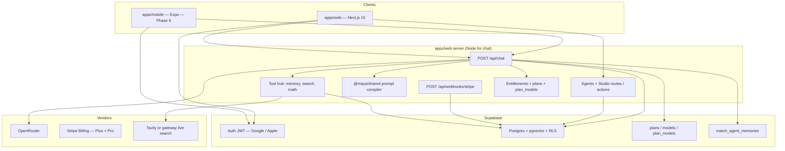
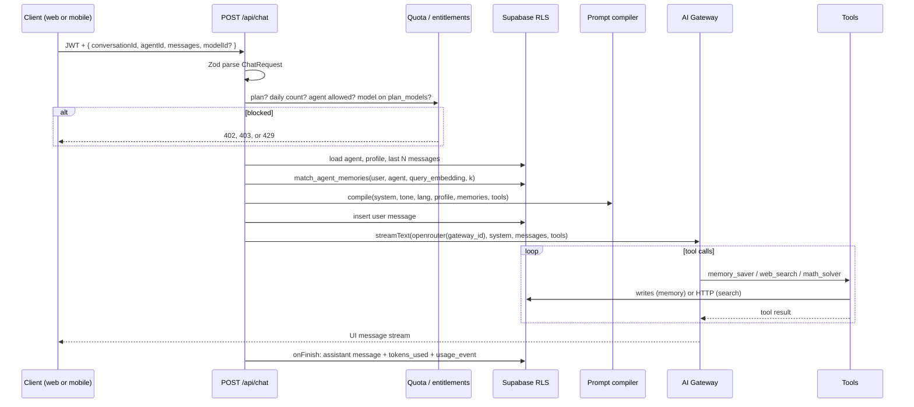

# HIGH-LEVEL TECHNICAL PLAN: Maya Chat

```yaml
---
document_id: "PLAN-MAYA-001"
title: "Maya Chat: High-Level Technical Plan"
version: "1.0.0"
status: "APPROVED-FOR-BUILD"
stage: "BUILD_MVP"
last_updated: "2026-09-10"
lead_engineer: "team-mates/cto"
related:
  - "PROJECT_DESCRIPTION.md"
  - "tech-stack.md"
  - "roadmap.md"
  - "architecture.md"
  - "prd.md"
  - "curated-agents.md"
---
```

Engineering plan for building Maya Chat as a **solo-maintained** multi-agent chat product. Handover: [`PROJECT_DESCRIPTION.md`](PROJECT_DESCRIPTION.md). Stack: [`tech-stack.md`](tech-stack.md). Sequence: [`roadmap.md`](roadmap.md). Original schema sketch: [`architecture.md`](architecture.md).

This is not a second PRD. It answers: **what we build, how a message flows, where state lives, and what can kill us**.

---

## 1. Design constraints

1. **One core loop:** pick an agent → pick an allowed model → stream a reply that stays in character → remember what matters for *that* agent.
2. **One server:** Next.js is the only process that talks to the **LLM gateway** and Stripe.
3. **Three plans, data-driven:** Free / Plus / Pro. Quotas, tools, and **model allowlists** live in Postgres, not `if (isPro)`.
4. **Web MVP in 14 days;** mobile consumes the same API in days 15–21. Voice, IAP, real code execution, group chat, marketplace, in-app catalog admin are **out**.
5. **Company gates:** Zod on inputs, RLS on tables, no secrets on the client, &lt;1 support ticket/week.
6. **Personas are the product.** The prompt compiler is a first-class module, not a string concat in the route handler.

---

## 2. System topology



Mobile never holds `OPENROUTER_API_KEY`. Both clients send a Supabase JWT; the chat route uses that JWT for RLS reads/writes.

---

## 3. Monorepo map

```
maya-chat/
├── apps/web/                 # Next.js — UI + all Route Handlers
├── apps/mobile/              # Expo — Phase 6
├── packages/shared/          # types, Zod, tones, prompt compiler, quota helpers
├── packages/database/        # supabase clients + generated types
└── supabase/migrations/
```

| Package | Owns | Must not own |
| :--- | :--- | :--- |
| `@maya/shared` | `Agent`, `ToneSettings`, `ChatRequest` Zod, `compilePrompt()`, language presets, plan/model helpers | React, Next, Expo, fetch to the gateway |
| `@maya/database` | Browser / server / service-role clients, `Database` types | Business rules |
| `apps/web` | UI, `/api/chat`, Stripe webhook, server actions | Duplicated prompt strings |
| `apps/mobile` | Native navigation + chat screen | Direct LLM or Stripe secret calls |

**Prompt compiler is unit-tested in `@maya/shared`.** If a persona “feels wrong,” the first question is the compiled system string, not the React tree.

---

## 4. Chat request lifecycle

This is the product. Everything else is support.



### 4.1 Route contract

`POST /api/chat` — Node runtime, `maxDuration = 60`.

Request (Zod, names illustrative):

```ts
{
  conversationId: uuid,
  agentId: uuid,
  modelId?: string,      // alias in public.models.id; omit → plan default
  messages: UIMessage[]  // AI SDK UI messages, not ad-hoc {role,content} forever
}
```

Response: `result.toUIMessageStreamResponse()` so `@ai-sdk/react` `useChat` can render tool parts, not only text.

Auth: Supabase session from cookies (web) or `Authorization: Bearer <access_token>` (mobile). Reject anonymous.

### 4.2 Persistence rules

1. Insert the **user** message **before** the model runs (so crashes still leave the turn).
2. Insert the **assistant** message in `onFinish` (full text + `tool_calls` JSON + `tokens_used`).
3. Do not stream-write partial assistant rows.
4. Conversation `title`: first user message truncated, or a cheap title pass later — not a second LLM call in MVP.
5. Conversation `updated_at` bumped on each finished turn.

### 4.3 Model routing (catalog)

1. Load `entitlements.plan` → `plans` + `plan_models` + `models` where `models.is_enabled`.
2. If `modelId` omitted → `plans.default_model_id`.
3. If `modelId` not in that set → **403** with `{ allowedModelIds }`. Never silently upgrade.
4. `streamText({ model: openrouter(models.gateway_id) })`.
5. Tools registered = intersection of `agents.tools_enabled` and `plans.tools_allowed`.
6. Daily cap = `plans.daily_message_limit` (`null` = unlimited). Count **before** the gateway call.

The client must not pass a raw gateway string. Only aliases from `GET /api/models`.

---

## 5. Prompt compiler

**Input**

| Field | Source |
| :--- | :--- |
| `basePrompt` | `agents.system_prompt` (server-only for curated) |
| `tone` | `agents.tone_settings` JSON |
| `languagePreset` | `agents.language_preset` + `profiles.preferred_language` |
| `profile` | `profiles.display_name`, `global_bio` |
| `memories` | top-k strings from RPC |
| `toolsEnabled` | `agents.tools_enabled` |

**Merge order (stable, tested):**

1. Identity + behavioral loop (`basePrompt` from [`curated-agents.md`](curated-agents.md))
2. Tone overlay — **custom agents only**. Numeric sliders rendered as **imperative rules**, not “warmth: 0.1”. Curated prompts already encode voice; sliders on those rows are display-locked.
3. Language / dialect rules (en, Hinglish, Warm Hindi, slang)
4. `<user_profile>` block
5. `<episodic_memory>` block — labeled, dated, agent-private
6. Tool policy — intersection of `agents.tools_enabled` and `plans.tools_allowed`. Omit tool-call instructions for tools not in that set (Free must not be told to call `memory_saver`).

Tone overlay example (compiler output, not UI):

> Directness is 1.0: do not soften. Do not apologize. Lead with the roast, then the prescription.

Gallery UI receives `{ id, name, tagline, avatar_url, category, tone_settings, tools_enabled }`. **Full curated `system_prompt` does not go to the client.** Custom agents are user-owned; their prompt is visible in Studio.

---

## 6. Data additions (beyond architecture.md)

Keep the six tables in [`architecture.md`](architecture.md). Add the following in the first migration set.

### 6.1 Catalog — models, plans, plan_models

This is how **Free / Plus / Pro** stay configurable. Seed aliases: [`PROJECT_DESCRIPTION.md`](PROJECT_DESCRIPTION.md) §3.

```sql
create table public.models (
  id text primary key,                  -- alias: 'grok-fast', 'claude'
  gateway_id text not null,             -- OpenRouter slug: 'x-ai/grok-4.20'
  display_name text not null,
  provider text not null,               -- openai, anthropic, google, xai, moonshot, qwen, deepseek
  supports_tools boolean not null default true,
  is_enabled boolean not null default true,
  sort_order int not null default 0
);

create table public.plans (
  id text primary key,                  -- 'free', 'plus', 'pro'
  display_name text not null,
  monthly_price_cents int not null default 0,
  yearly_price_cents int,
  stripe_price_id_monthly text,
  stripe_price_id_yearly text,
  daily_message_limit int,              -- null = unlimited
  max_custom_agents int,                -- null = unlimited
  curated_agent_limit int,              -- null = all curated
  vector_memory boolean not null default false,
  tools_allowed text[] not null default '{}',
  default_model_id text not null references public.models(id),
  is_active boolean not null default true
);

create table public.plan_models (
  plan_id text not null references public.plans(id) on delete cascade,
  model_id text not null references public.models(id) on delete cascade,
  primary key (plan_id, model_id)
);

alter table public.models enable row level security;
alter table public.plans enable row level security;
alter table public.plan_models enable row level security;

create policy "Authenticated read models"
  on public.models for select to authenticated using (true);
create policy "Authenticated read plans"
  on public.plans for select to authenticated using (true);
create policy "Authenticated read plan_models"
  on public.plan_models for select to authenticated using (true);
-- writes: service role / founder only
```

Seed `plans` rows: `free` (0¢, 50/day, 3 public custom, 2 curated via `agents.free_tier`, no vector, default `gemini-flash`), `plus` (900¢ / 9000¢ yr, 200/day, 10 custom, all 8 curated, vector, tools memory+math, default `grok`), `pro` (1900¢ / 19000¢ yr, unlimited, unlimited custom, all 8 curated, vector, tools + search, default `claude`).

### 6.2 Entitlements

```sql
create table public.entitlements (
  user_id uuid primary key references auth.users(id) on delete cascade,
  plan text not null default 'free' check (plan in ('free', 'plus', 'pro')),
  status text not null default 'active' check (status in ('active', 'past_due', 'canceled')),
  source text not null default 'manual' check (source in ('stripe', 'revenuecat', 'manual')),
  stripe_customer_id text,
  stripe_subscription_id text,
  current_period_end timestamptz,
  updated_at timestamptz default now() not null
);
alter table public.entitlements enable row level security;
create policy "Users read own entitlement"
  on public.entitlements for select using (auth.uid() = user_id);
-- writes: service role from webhook only
```

Do **not** authorize on `profiles.is_pro`. Optional cache: `profiles.plan text`. Webhook maps Stripe `price_id` → `plans.id` via `stripe_price_id_monthly` / `yearly`. Grace: treat `past_due` as still on the paid plan until `canceled`.

### 6.3 Usage

```sql
create table public.usage_events (
  id uuid primary key default gen_random_uuid(),
  user_id uuid not null references auth.users(id) on delete cascade,
  event_type text not null check (event_type in ('chat_turn')),
  created_at timestamptz default now() not null
);
create index usage_events_user_day
  on public.usage_events (user_id, created_at);
alter table public.usage_events enable row level security;
create policy "Users read own usage"
  on public.usage_events for select using (auth.uid() = user_id);
```

Cap = `plans.daily_message_limit` for the user’s plan (`null` = unlimited). Count **before** `streamText`. Still log Pro turns for cost. Failed/aborted streams count if the model was invoked (prevents retry abuse).

### 6.4 Memory RPC

```sql
-- N = embedding dim pinned at scaffold (see tech-stack.md §4)
create index agent_memories_embedding_idx
  on public.agent_memories
  using hnsw (embedding vector_cosine_ops);

create index agent_memories_user_agent_idx
  on public.agent_memories (user_id, agent_id);

create or replace function public.match_agent_memories(
  p_agent_id uuid,
  p_query vector,
  p_match_count int default 8
)
returns table (id uuid, content text, metadata jsonb, similarity float)
language sql
stable
as $$
  select
    m.id,
    m.content,
    m.metadata,
    1 - (m.embedding <=> p_query) as similarity
  from public.agent_memories m
  where m.user_id = auth.uid()
    and m.agent_id = p_agent_id
    and m.embedding is not null
  order by m.embedding <=> p_query
  limit least(p_match_count, 16);
$$;
```

Filter **in SQL**, not in JS after `select *`. Isolation between agents is this `agent_id` predicate plus RLS. A Childhood-Friend memory must be unreachable from Dr. Priya even if cosine similarity is high.

Also add:

```sql
create index messages_conversation_created_idx
  on public.messages (conversation_id, created_at);
```

### 6.5 Profile trigger

On `auth.users` insert: create `profiles` + `entitlements (plan='free')`. Never rely on the client to create these rows. Vector retrieve/write only if `plans.vector_memory` is true for the current entitlement.

---

## 7. Access control (read from `plans`, not literals)

Seed values below; **runtime reads the table**.

| Action | Free (seed) | Plus (seed) | Pro (seed) |
| :--- | :--- | :--- | :--- |
| Daily messages | 50 | 200 | Unlimited |
| Curated agents | 2 (Marcus + Priya) | All 8 | All 8 |
| Custom agents | 3, public only | 10, public or private | Unlimited |
| Vector memory | No | Yes | Yes |
| Tools | `{}` | memory, math | + `web_search` |
| Models | `plan_models` for `free` | `plan_models` for `plus` | `plan_models` for `pro` |
| Voice | — | — | v1.1 |

Starter pair for free: **Marcus + Dr. Priya**. Runtime rule: a curated agent is reachable if `entitlements.plan` is `plus`/`pro` **or** `agents.free_tier` is true. Do not hardcode names in the route. `plans.curated_agent_limit` is documentation only; `agents.free_tier` is the gate. Curated tone sliders are locked (prompts already encode voice).

Studio writes are allowed when `plans.max_custom_agents` is null or the user’s live custom count is below it. Seed: Free 3, Plus 10, Pro unlimited. Free may only create **public** custom agents. Plus and Pro may create private ones. Quota and the private gate live in `evaluateStudioWrite` (`@maya/shared`) and in `private.enforce_custom_agent_quota`. Not CSS-only.

`canUseAgent` is the chat authorization seam: curated via `free_tier` / plan, custom via owner or (`is_public` and not archived). Chat loads `system_prompt` with the service role **after** that check. Authenticated clients never `SELECT system_prompt`.

---

## 8. Tool hub

Shared factory: `createTools({ userId, agentId, enabled: string[] })`.

| Tool | `execute` | Failure |
| :--- | :--- | :--- |
| `memory_saver` | Insert row, embed with `"passage: "` prefix, update `embedding`. Cap content length (~2k chars). | Return `{ ok: false, error }` to the model; do not throw the stream down. |
| `web_search` | HTTP, 8s abort, ≤5 snippets `{ title, url, snippet }`. | Empty results + “search unavailable”. |
| `math_solver` | Return structured steps; optional numeric eval. | Ask the model to solve without the tool. |
| `code_sandbox` | Stub `{ status: "unsupported" }`. | Always. |

`stopWhen: stepCountIs(5)` so a confused model cannot loop tools.

---

## 9. API surface (MVP)

Prefer **Server Actions** for CRUD that is web-only (studio save, profile). Keep **Route Handlers** for anything mobile must call.

| Endpoint | Runtime | Caller |
| :--- | :--- | :--- |
| `POST /api/chat` | Node | Web + mobile; `modelId` vs `plan_models` |
| `GET /api/models` | Node | Web + mobile — enabled models on the caller’s plan + `defaultModelId` |
| `GET /api/agents` | Node | Web + mobile — curated metadata + user's custom |
| `POST /api/agents` | Node | Later mobile wrap of the Studio server action. Web MVP uses server actions. |
| `PATCH /api/agents/:id` | Node | Studio, owner only |
| `GET /api/conversations` | Node | Sidebar / mobile inbox |
| `POST /api/conversations` | Node | New thread |
| `GET /api/conversations/:id/messages` | Node | History hydrate |
| `POST /api/billing/checkout` | Node | Web; body `{ planId: 'plus' \| 'pro' }` |
| `POST /api/webhooks/stripe` | Node | Stripe; raw body; signature verify |
| `POST /api/billing/portal` | Node | Customer Portal |

Webhook: idempotent on `event.id` (small `stripe_events` table). Map `price_id` → `plans.id`; write `entitlements.plan` (`free` if the subscription is deleted). Optional `profiles.plan` cache in the same transaction.

---

## 10. Auth

| Client | Flow |
| :--- | :--- |
| Web | `@supabase/ssr` cookies. OAuth redirect → `app/(auth)/callback`. |
| Mobile | PKCE. Deep link redirect. Session in SecureStore. |

Google + Apple on both. No password-only as the only path (optional email magic link is fine).

JWT is the RLS key. Chat route creates a Supabase client **with the user token**, not the service role, for agent/memory/message reads. Service role is webhook + (optional) embedding backfill only.

---

## 11. Security

| Threat | Mitigation |
| :--- | :--- |
| IDOR on conversations / memories | RLS: `auth.uid() = user_id`. Messages via conversation ownership subquery (already in architecture.md). |
| Prompt leak of curated agents | Do not select `system_prompt` in gallery APIs. |
| Entitlement bypass | Server reads `entitlements.plan` + `plans` + `plan_models`; ignore client `plan` / `model`. |
| Model upgrade | 403 if `modelId` not on the plan. Client cannot send `gateway_id`. |
| Quota bypass | Insert `usage_events` when the model is invoked; check against `plans.daily_message_limit`. |
| Secret exfil | No `OPENROUTER_*` / Stripe secret / service role in `NEXT_PUBLIC_` or Expo public env. |
| Tool injection | Zod on tool inputs; memory content length cap; search URL allow-list not required if we only return snippets. |
| Code execution | Stubbed in MVP. |
| Stripe replay | Signature + processed event ids. |
| Cost bomb | Max output tokens, `stepCountIs(5)`, plan daily cap, search only if on `tools_allowed`. |

Company checklist before calling a slice done: RLS enabled, `tsc --noEmit` clean, Zod on the handler, no private keys in the client bundle.

---

## 12. Failure modes

| Failure | User sees | System does |
| :--- | :--- | :--- |
| Zod fail | 400 | No LLM call |
| Not signed in | 401 | — |
| Locked agent for plan | 403 | — |
| Over daily cap | 429 with reset time | — |
| `modelId` not on plan | 403 + allowed list | — |
| Studio over `max_custom_agents` | 402 | Checkout URL for Plus/Pro on web |
| Free private custom agent | 402 | Private roles are Plus |
| Gateway timeout / 5xx | Stream error part | User message already saved; no assistant row |
| Tool timeout | Model continues without tool | Log |
| Stripe webhook bad sig | 400 | No entitlement change |
| Embed fail on memory save | Memory row with `embedding null` | Retry job optional; retrieval skips nulls |

Do not toast stack traces. Sentry on server + `tokens_used` on messages is enough for v1.

---

## 13. UX surfaces (web MVP)

Enough structure for engineering, not a design spec.

| Surface | Behavior |
| :--- | :--- |
| Gallery | 8 curated cards + custom list. Locked cards CTA to Plus/Pro. |
| Chat | Message list, markdown, KaTeX, code highlight, pending tool chips. Agent name + avatar. **Model picker** from `GET /api/models`. |
| Studio | Name, tagline, category, language preset, tone sliders, backstory textarea, tool toggles. Preview pane can wait until Phase 3 if time-boxed. |
| Settings | Profile bio/language, Stripe portal (upgrade/downgrade Plus ↔ Pro). |
| Pricing | Three columns; model names from catalog, not hardcoded marketing fiction. |

Mobile Phase 6: Gallery tab, Chat stack, Settings. No Studio v1 on mobile if time is tight — web Studio still creates agents the mobile app can chat with.

---

## 14. Testing (minimum)

| Layer | What |
| :--- | :--- |
| `@maya/shared` | Prompt merge order; tone copy at slider extremes; “is this model on this plan” helper |
| Chat route | Mock `streamText`: unauthenticated, over-quota, wrong agent, **wrong model for plan**, happy stream `onFinish` persist |
| RLS | SQL tests or a small script: user A cannot read user B memories/messages |
| Stripe | Fixture Plus and Pro price events → `entitlements.plan` |
| Smoke | One scripted conversation with Marcus after deploy |

No need for full Playwright in week 1. Add it when the chat UI exists if time remains in Phase 5.

---

## 15. Operations & cost

- **Deploy web:** Vercel preview on PR, production on `main`.
- **DB:** Supabase preview branches optional; not required for sprint 1. Production project + local `supabase start` for agents.
- **Secrets:** Vercel env + EAS secrets later.
- **On-call:** founder. If a tool pages you, it should not have shipped (hence no sandbox).

Cost knobs: `plan_models` + `daily_message_limit`, embed-on-write, search only on Pro seed, `vector(N)` pinned small. To add a model to Plus: `INSERT INTO plan_models` — no deploy.

---

## 16. Open items (scaffold-time, not blockers for these docs)

1. Exact embedding **model id** and **dimension N** (one vendor).
2. Exact **gateway_id** strings for the seed aliases — OpenRouter slugs, pinned in `apps/web/lib/openrouter/catalog.ts`.
3. Search vendor: Tavily vs gateway live search — pick on Day 8, one wrapper interface.
4. Whether free tier gets last-N **text** memory (no vectors) or no memory at all. Default: **no vector memory on free**; last 20 messages in the window still give short-term recall.

Do not block planning on these. Pin them in a one-line comment in the migration / env example when the repo is scaffolded.
